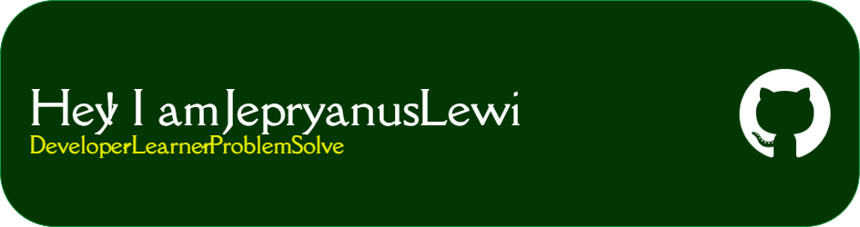

---

💡 **About Me**  `  
- 🌱 I’m currently learning: Flutter, Dart, Firebase, JavaScript, TypeScript, Html, Css
- 💬 Ask me about: Android Dev, Front End Development  
- 📫 How to reach me: jepryanuslewi@gmail.com  
- ⚡ Fun fact: I can debug with one eye closed

---

🛠️ **Tech Stack**  

---

📈 **GitHub Stats**  

  
  

---
  

🌍 **Let's Connect**  

<!-- 
 -->
